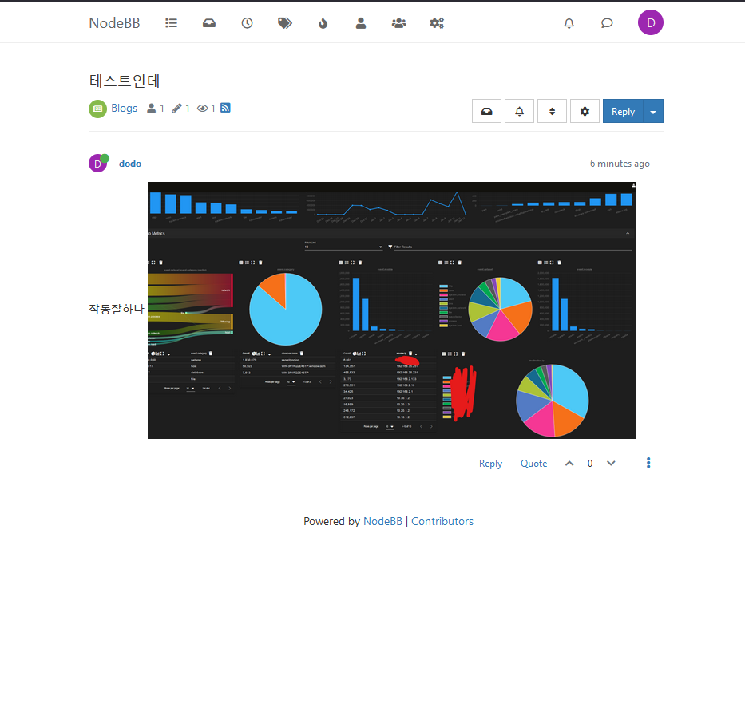
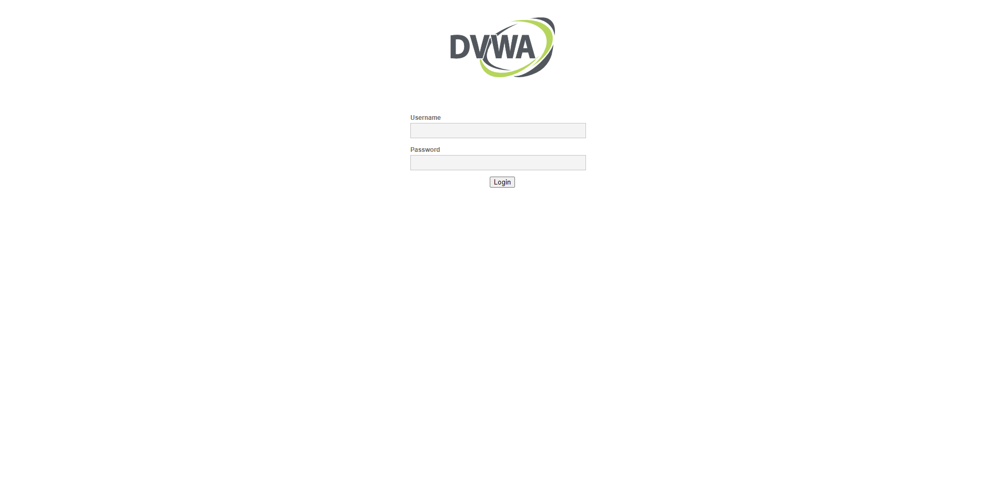
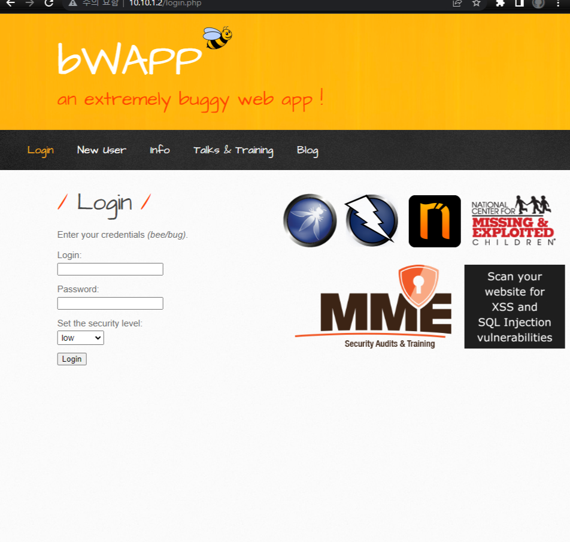
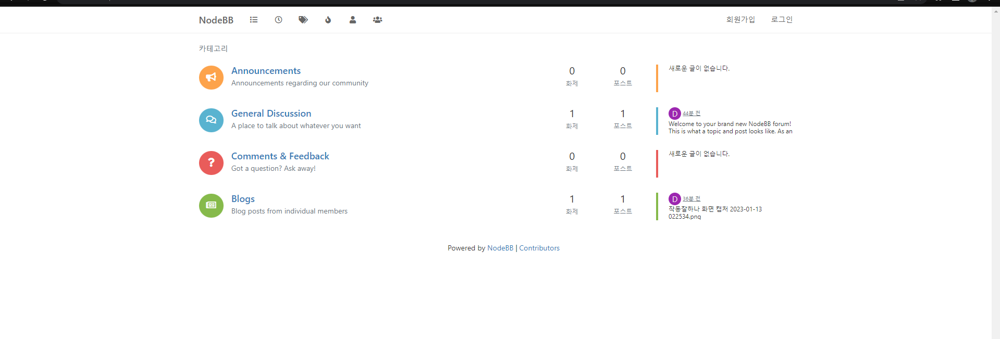
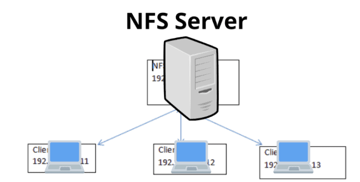

# nodebb


# 서론
솔직히 개발자가 아니라 모든 개발프로세스를 다 공부할 시간이 부족합니다. 그렇기에 이런 프로젝트를 써야한다 보면됩니다.  
개인적으로 해킹의 기초를 배우고싶다면은 bwapp이나 dvwa로도 충분한데 아래에 docker script를 줄테니 따로 작성하여 공부하시길 바랍니다. 

# dvwa

``` bash
docker run -d --name dvwa -p80:80 truecharts/dvwa-web
```

# bwapp

``` bash
docker run --name bwapp -d -p 80:80 raesene/bwapp
```

> 접속할떄는 install.php로 db를 설치해줘야 하기에 아래 주소를 입력하고 실행해주세요.
``` bash
localhost/install.php
```

# 본론
webserver는 10.10.1.2를 기본으로 시작합니다.  10.10.1.3도 나중에 사용할껀데 이것은 HAProxy를 이용한 webserver 클러스터란 느낌으로 10.10.0.0/16을 사용할꺼라 생각하면 좋습니다.  

> 10.10.1.2
``` bash
docker run --name nodebb -d -p 4567:4567 nodebb/docker
```

> 10.40.1.2
``` bash
docker run --name postgres -v /home/web_db/postgres:/var/lib/postgresql/data -p 5432:5432 -e "POSTGRES_USER=nbbuser" -e "POSTGRES_PASSWORD=SomeLongPasswordForTheUser" -e "POSTGRES_DB=nodebbdb" -d postgres:15.1-bullseye
```

> 10.10.1.2:4567

* Database Type: Leave the field blank to use the default settings.
* Host IP or address of your PostgreSQL instance: 10.40.1.2
* Host port of your PostgreSQL instance: 5432
* PostgreSQL username: nbbuser
* Password of your PostgreSQL database: SomeLongPasswordForTheUser
* PostgreSQL database name: nodebbdb
* Enable SSL for PostgreSQL database access: disable

그리고 쭉 설치버튼을 누르면 됩니다.  초기화면은 다른데 재접속을 하면은 아래와같이 뜹니다.  
이러면 postgresql와 webserver을 순식간에 구축할수있습니다.  
주의할점은 license는 `GPL 라이센스`입니다.  
오픈소스이기는 한데 공짜는 아니기에 주의하시길 바랍니다.  



# container 배포
HAproxy와 docker 배포를 가볍게 해볼것입니다. 나중에 작성할것은 ansible과 kubernetes를 조합한 솔루션도 작성할것인데 아직은 아닙니다.  

> 10.10.1.2

``` bash
docker ps -a --format "table {{.Names}} {{.Ports}}"
```

``` bash
docker stop nodebb &&\
docker commit nodebb my_nodebb 
```

``` bash
docker save my_nodebb:latest | gzip > my_nodebb.tar.gz
```

``` bash
scp my_nodebb.tar.gz web@10.10.1.3:/home/web/container
```

> 10.10.1.3

``` bash
cd /home/web/container && \
docker import nodebb.tar
```
`import nodebb.tar 뒤에 이름 적어도 이름 만들어짐`
``` bash
docker tag aba25010509f my_nodebb:1.0
```

``` bash
docker run --name nodebb  -d -p 4567:4567 nodebb/docker
```

# 웹서버 트러블슈팅
파일은 보통 웹서비스에서 db에 저장하지않고 주소만을 저장합니다.  
그렇기에 클러스터의 다른 노드는 파일을 동기화하지 못하는 문제가 발생합니다.  
이러한 문제를 해결하는 가장 쉬운방법은 NFS라는 시스템을 만드는겁니다.  
다른 cloudfare나 프로토콜들이 많지만 가장 대표적인 NFS라는 시스템으로 일단은 만들어볼것입니다.

# NFS-server 설치



> 10.20.1.2 (office server[마스터 서버느낌으로 사용할것])
``` bash
sudo apt-get update -y &&\
apt -y install nfs-kernel-server
```

``` bash
sudo mkdir /nfsshare 
```

``` bash
sudo chown nobody:nogroup /nfsshare &&\
chmod 755 /nfsshare
```

``` bash
sudo vim /etc/exports
```
    #rw – Provide read and write access on the shared directory.
    #sync – Reply to requests only after the changes have been committed to stable storage.
    #no_subtree_check – Disables subtree checking.

    /nfsshare    10.10.1.0/16(rw,sync,no_root_squash)

``` bash
sudo systemctl restart nfs-server
```

``` bash
sudo systemctl status nfs-server
```


# NFS-Client 설치

``` bash
sudo apt-get install nfs-common -y
```

``` bash
sudo mount 10.11.1.3:/nfsshare /home/web/file
```

# 파일 동기화 시키기
아직은 동기화시키지 않았기에 동기화를 시켜야합니다. 일단 file을 복사합니다.
``` bash
sudo docker cp -aL nodebb:/usr/src/app/public/uploads/files/. /home/web/file
```
여기서부터는 수 많은 방법론이있는데 가장 심플한 방법은 컨테이너를 하나 더만들어서 
임시로 거기로 로드벨런서를 통하여 유저들을 옮기게 한후에  
본 컨테이너는 삭제하고 새로운 컨테이너를 만들어서 그쪽으로 다시 로드벨런서로 옮기는게 가장 심플한 방법입니다.  
이것을 보통 쿠버네티스로 쉽게 할수있는데 수동으로 해볼껍니다.  

``` bash
docker run -d -p 4568:4567 --name nodebb_test -v /home/web/file:/usr/src/app/public/uploads/files my_nodebb:latest
```

만약을 위해 백업을 해줍시다.1
``` bash
docker stop nodebb &&\
docker commit nodebb_backup_2023_01_15
```

``` bash
docker run -d -p 4567:4567 --name nodebb -v /home/web/file:/usr/src/app/public/uploads/files my_nodebb:latest
```

정상작동하면 test버전의 컨테이너를 꺼줍니다

``` bash
docker rm -f nodebb_test
```

근