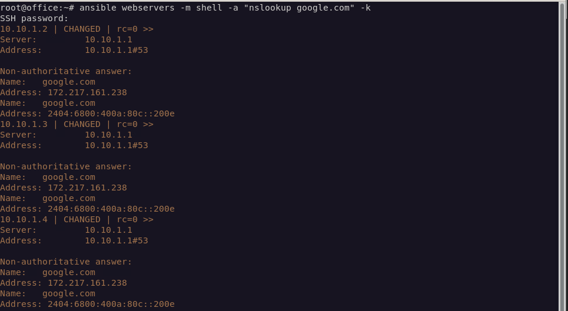

# 자동화 
서버를 대규모로 제어하는데 특화된 소프트웨어  
주로 온프레미스의 엔드포인트를 제어하는데 사용됨  
클라우는 테라폼이란 기술을 사용함  


# ansible 설치

설치자체는 매우 간단합니다.

``` bash
sudo apt -y update &&\
apt -y install ansible
```


``` bash
vim /etc/ansible/hosts
```
> /etc/ansible/hosts

``` bash
[linux]
10.10.1.2
10.10.1.3
10.11.1.2
10.11.1.3
10.20.1.2
10.20.1.3
10.40.1.2
10.60.1.2

[linux:vars]
ansible_python_interpreter=/usr/bin/python3
ansible_user=server
ansible_become_pass=1234
```

공개키 교환을 안하면은 에러가 뜰텐데 지금은 숫자가 적기도하고 한번 아래 방식으도 가능은 하다는걸 보시길 바래요.  

``` bash
ansible webservers -m ping -k
```

그리고 아래처럼 입력해주면은 기본세팅은 끝입니다. 

``` bash
ansible webservers -m "nslookup google.com" -k
```

# 하지만
이러한 방법은 호스트의 숫자가 많을수록 비효율적입니다. 적으면 수십대 많으면 수백 수천대의 노드가 있을텐데 언제까지 yes를 누를수가 없으니까요.
인터넷에는 ansible-playground를 사용하여 known_hosts를 이상하게 등록하는데 이건 복잡하기만 하고 비효율적입니다. 
ssh를 설치하면 있는 `ssh-keyscan`을 이용한 방법을 사용할 것 입니다. 
아래 코드는 호스트 ip만을 출력해주는 스크립트인데. 아래와 같이 해줍시다.


# 비밀번호

``` bash

#!/bin/bash
# Set the number of forks
password="1234"
host_list="host_list"

ansible all -m ping --list-hosts | grep -v hosts | awk '{print $1}' > host_list && ssh-keyscan -f host_list > ~/.ssh/known_hosts
while IFS= read -r host; do
    sshpass -p "$password" ssh-copy-id server@"$host" &
done < "$host_list"
wait
```

``` bash
ansible-console all
```
