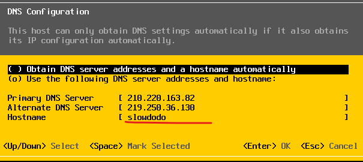
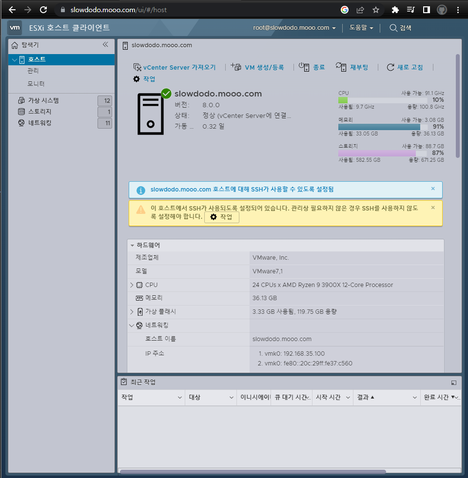

# SSL 인증

``` powershell
openssl genrsa -out ./rui.key 2048
```

``` powershell
openssl req -new -nodes -out ./rui.csr -keyout ./rui.key -config ./ssl.cfg
```

``` powershell
openssl x509 -req -days 365 -in ./rui.csr -signkey ./rui.key -out ./rui.crt -extensions v3_req -extfile ./ssl.cnf
```

``` powershell
Import-Certificate -FilePath ./rui.crt -CertStoreLocation Cert:\LocalMachine\Root

```

> /etc/vmware/ssl

rui.key와 rui.crt 복사하여 여기다 복붙

``` bash
services.sh restart
```

  


# DDNS 무료사이트 추천

[DDNS](https://freedns.afraid.org/)
