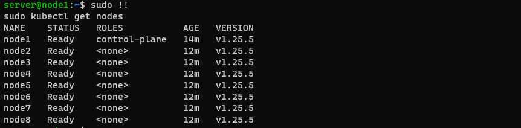
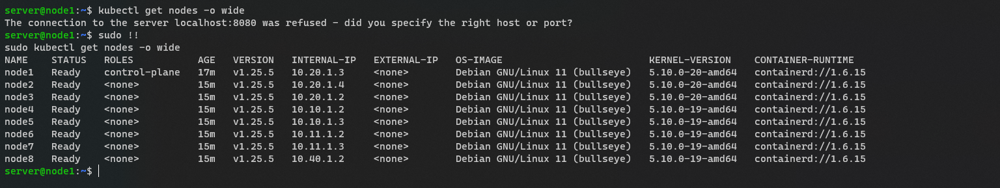

# k8n

쿠버네티스는 그냥 docker의 한계를 즉 컨테이너를 대량으로 관리하기 위해 만든 도구이다.  
docker container는 너무나도 다른 네트워크의 컨테이너를 관리하기 어렵다.  
클라우드에서든 인프라망에서든 어렵기에 구글이 만든 노하우의 집약체입니다.  

# 설치
수억대의 컨테이너와 수천 수만대의 노드를 관리하기 위해 만든거기도 하고 현재 가장 핫한 기술이기에 
다양한 솔루션이 있는데 ansible-galaxy로 만든 솔루션을 활용할겁니다.  
주의해야될점은 debian, ansible의 버전, 파이썬, pip의 버전이 맞아야합니다.

[koberspary](https://github.com/kubernetes-sigs/kubespray)

설치를 쉽게할려면 master node에 설치해야됩니다. 
``` bash
git clone https://github.com/kubernetes-sigs/kubespray.git
```

``` bash
cp -rfp inventory/sample inventory/mycluster
```

``` bash
sudo apt -y update &&\
sudo apt -y install python3-pip 
```

``` bash
sudo pip install -r requirements.txt
```

여기서 주의해야될건 10.20.1.3이 master node가 되어서 다른 노드들을 관리하는 클러스터를 만들기에  
master node를 10.20.1.3으로 설정해야됩니다.
``` bash
declare -a IPS='10.20.1.3 10.10.1.2 10.10.1.3 10.11.1.2 10.11.1.3 10.40.1.2'
```

``` bash
CONFIG_FILE=inventory/mycluster/hosts.yaml python3 contrib/inventory_builder/inventory.py ${IPS[@]}
```

# 실행중 에러들

## 실행하고나서 바로 에러
ansible이 제대로 작동하는지, 권한이 맞는지, ip가 맞지않은지 테스트하셔야합니다. 

## os boot
이건 보통 설치할떄 sudo 권한 문제인 경우가 많습니다.  

``` bash
sudo usermod -aG sudo server
```

## etcd 짝수문제

짝수로 사용할 경우 `스플릿 브레인(Split Brain)` 현상이 발생하여 네트워크 단절로 인한 통신 장애 등 문제가 발생할 여지가 존재 합니다.
RAFT알고리즘에 의하여 짝수이면은 발생하는 구조적 문제에 의하여 그런겁니다.
만약에 실제 서비스로 사용하고싶다면은 다른 서버를 추가해주셔야합니다.  
저는 더이상 노드를 늘리기는 현실적으로 힘들어서 예외처리 했습니다.  

홀수라면 다른 큰 문제가 없다면은 예외처리로 실행하셔야합니다. 


## 속도개선
참고로 설치 실행속도를 빠르게 하고싶다면은 ansible의 `fork`설정을 하여서 소모하는 자원량을 늘리면 됩니다. 그러면은 각각 노드마다의 설치가 더욱 분산되어서 빨라집니다.  


## 주의사항
ansible.cfg는 처음엔 ./ansible.cfg가 있는지 먼저 찾기에 /etc/ansible/ansible.cfg에 설정을 입력했다 하더라도 최우선은 현재 디렉터리에 있는 ansible설정을 찾습니다.

참고로 hostname을 바꾸면은 sudo속도가 느려지는데 이때 ansible deafult 설정인 13초 이상의 ssh 지연이 발생하면 에러가 그대로 발생하게되니 만약을 대비해서 30초이상의 설정을 사용하시기 바랍니다.

`server@server:~/kubespray$ vim ./ansible.cfg`
``` bash
[ssh_connection]
pipelining=True
ansible_ssh_args = -o ControlMaster=auto -o ControlPersist=30m -o ConnectionAttempts=100 -o UserKnownHostsFile=/dev/null
#control_path = ~/.ssh/ansible-%%r@%%h:%%p
[defaults]
# https://github.com/ansible/ansible/issues/56930 (to ignore group names with - and .)
force_valid_group_names = ignore
# 추가한 내용
forks=100
timeout = 60

host_key_checking=False
gathering = smart
fact_caching = jsonfile
fact_caching_connection = /tmp
fact_caching_timeout = 86400
stdout_callback = default
display_skipped_hosts = no
library = ./library
callbacks_enabled = profile_tasks,ara_default
roles_path = roles:$VIRTUAL_ENV/usr/local/share/kubespray/roles:$VIRTUAL_ENV/usr/local/share/ansible/roles:/usr/share/kubespray/roles
deprecation_warnings=False
inventory_ignore_extensions = ~, .orig, .bak, .ini, .cfg, .retry, .pyc, .pyo, .creds, .gpg
[inventory]
ignore_patterns = artifacts, credentials
```


# 아래는 hosts.yml의 설정인데 참고하시면 됩니다. 


> root@node1:/home/server/kubespray# cat inventory/mycluster/hosts.yaml
``` bash
all:
  hosts:
    node10-2:
      ansible_host: 10.10.1.2
      ip: 10.10.1.2
      access_ip: 10.10.1.2
    node10-3:
      ansible_host: 10.10.1.3
      ip: 10.10.1.3
      access_ip: 10.10.1.3
    node20-2:
      ansible_host: 10.20.1.2
      ip: 10.20.1.2
      access_ip: 10.20.1.2
    master20-3:
      ansible_host: 10.20.1.3
      ip: 10.20.1.3
      access_ip: 10.20.1.3
    node20-4:
      ansible_host: 10.20.1.4
      ip: 10.20.1.4
      access_ip: 10.20.1.4
    node11-2:
      ansible_host: 10.11.1.2
      ip: 10.11.1.2
      access_ip: 10.11.1.2
    node11-3:
      ansible_host: 10.11.1.3
      ip: 10.11.1.3
      access_ip: 10.11.1.3
    node40-2:
      ansible_host: 10.40.1.2
      ip: 10.40.1.2
      access_ip: 10.40.1.2
  children:
    kube_control_plane:
      hosts:
        master20-3:
    kube_node:
      hosts:
        node10-2:
        node10-3:
        node20-2:
        master20-3:
        node20-4:
        node11-2:
        node11-3:
        node40-2:
    etcd:
      hosts:
        node20-2:
        master20-3:
        node20-4:
    k8s_cluster:
      children:
        kube_control_plane:
        kube_node:
    calico_rr:
      hosts: {}
```

자신이 원한 master 노드인지 확인해주시길 바랍니다.
etcd나, control_plaen, 노드가 잘못설정됐는지 확인해야합니다.  
cluster 설정을 변경할순있는데 잘 안될수도있어서 복잡해짐
 

``` bash
cat inventory/mycluster/hosts.yaml
```

etcd는 클러스터에 어떤 노드가 몇 개나 있고 어떤 파드가 어떤 노드에서 동작하고 있는지 등을 담고있는 클러스터입니다.  
개인용이면 node1를 한개여도 작동하는데 문제가없지만 실 사용목적이면 최소 3개이상이어야하고 
짝수면은 `RAFT 합의 알고리즘` 으로 설계된 한계로 인하여  HA가 꺠질수있기에 권장되지않는 방법입니다. 
``` bash
etcd:
  node1:
  node2:
  node3:
```

``` bash
ansible-playbook -i inventory/mycluster/hosts.yaml  --become --become-user=root cluster.yml -K -e ignore_assert_errors=yes
```




