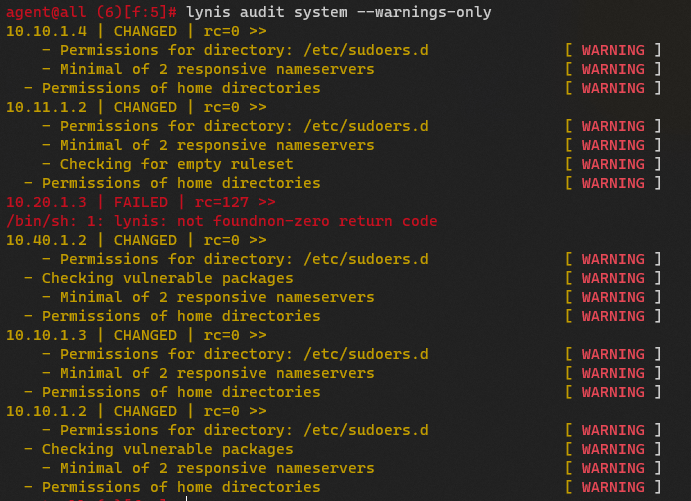

#
[awx 설치링크](https://computingforgeeks.com/how-to-install-ansible-awx-on-centos-7/?expand_article=1#google_vignette)


# Infra - Security Onion 

security onion 2.4 버전

  

  

  

  

  


``` bash
root@master20-2 /home/server # kubectl top node
NAME         CPU(cores)   CPU%   MEMORY(bytes)   MEMORY%
master20-2   223m         11%    3203Mi          83%
node10-2     158m         5%     2463Mi          64%
node10-3     152m         5%     2478Mi          64%
node40-2     85m          4%     2174Mi          56%
node40-3     95m          4%     2160Mi          56%
```

# 공식문서들
[SO-firewall](https://docs.securityonion.net/en/2.3/firewall.html)  
[Pfsense-doc](https://docs.netgate.com/pfsense/en/latest/)  
[suricata-doc](https://suricata.readthedocs.io/en/suricata-6.0.9/)  
[snort-doc](https://www.snort.org/documents)  
[kuberspray](https://kubernetes.io/ko/docs/setup/production-environment/tools/kubespray/)
