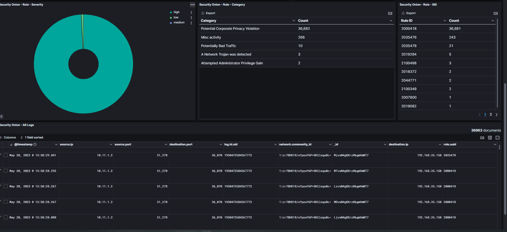
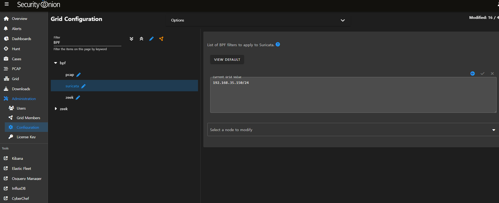

# FTP False_Negative


# False Negative
``` bash
[root@siem nids]# grep 2000418 /opt/so/rules/nids/all.rules
alert tcp $EXTERNAL_NET !$HTTP_PORTS -> $HOME_NET any (msg:"ET POLICY Executable and linking format (ELF) file download"; flow:established; content:"|7F|ELF"; fast_pattern; content:"|00 00 00 00 00 00 00 00|"; distance:3; flowbits:set,ET.ELFDownload; reference:url,www.itee.uq.edu.au/~cristina/students/david/honoursThesis96/bff.htm; classtype:policy-violation; sid:2000418; rev:17; metadata:created_at 2010_07_30, former_category POLICY, updated_at 2021_11_18;)
```

# BPF (Barkely Packet filter)
리눅스 커널단에서 동작하는 필터링 시스템
``` bash
192.168.35.150/24 
```



# SSH

``` bash
alert tcp $HOME_NET any -> $EXTERNAL_NET 22 (msg:"ET SCAN Potential SSH Scan OUTBOUND"; flow:to_server; flags:S,12; threshold: type threshold, track by_src, count 5, seconds 120; reference:url,en.wikipedia.org/wiki/Brute_force_attack; reference:url,doc.emergingthreats.net/2003068; classtype:attempted-recon; sid:2003068; rev:7; metadata:created_at 2010_07_30, updated_at 2010_07_30;)
```