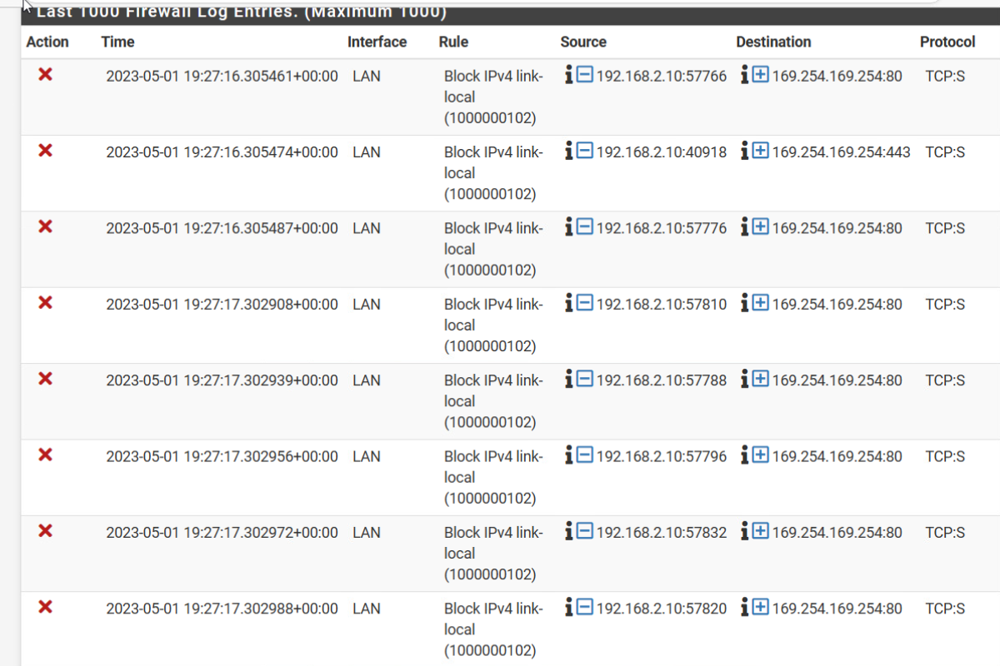

# linux local link flooding 현상


``` bash
route add -net 169.254.169.0/24 dev ens34
```

``` bash
[server@securityonion ~]$ route -n
Kernel IP routing table
Destination     Gateway         Genmask         Flags Metric Ref    Use Iface
0.0.0.0         10.60.1.1       0.0.0.0         UG    100    0        0 ens34
10.60.1.0       0.0.0.0         255.255.255.0   U     100    0        0 ens34
169.254.0.0     0.0.0.0         255.255.0.0     U     0      0        0 ens34
172.17.0.0      0.0.0.0         255.255.255.0   U     0      0        0 docker0
172.17.1.0      0.0.0.0         255.255.255.0   U     0      0        0 sobridge
```


``` bash
 sed -i 's/`$(cat ip)`/'$(cat ip)'/g' /etc/network/interfaces
```

# 영구저장
## redhat
``` bash
sudo nmtui
```

``` bash
nmcli con down ens34 && nmcli con up ens34
```

``` bash
[root@securityonion server]# nmcli device show ens34
GENERAL.DEVICE:                         ens34
GENERAL.TYPE:                           ethernet
GENERAL.HWADDR:                         00:0C:29:F1:4C:92
GENERAL.MTU:                            1500
GENERAL.STATE:                          100 (connected)
GENERAL.CONNECTION:                     ens34
GENERAL.CON-PATH:                       /org/freedesktop/NetworkManager/ActiveConnection/1
WIRED-PROPERTIES.CARRIER:               on
IP4.ADDRESS[1]:                         10.60.1.2/24
IP4.GATEWAY:                            10.60.1.1
IP4.ROUTE[1]:                           dst = 169.254.169.0/24, nh = 0.0.0.0, mt = 100
IP4.ROUTE[2]:                           dst = 10.60.1.0/24, nh = 0.0.0.0, mt = 100
IP4.ROUTE[3]:                           dst = 0.0.0.0/0, nh = 10.60.1.1, mt = 100
IP4.DNS[1]:                             8.8.8.8
IP4.DNS[2]:                             8.8.4.4
IP4.DNS[3]:                             210.220.163.82
IP4.DOMAIN[1]:                          pfsense.local.com
IP6.ADDRESS[1]:                         fe80::20c:29ff:fef1:4c92/64
IP6.GATEWAY:                            --
IP6.ROUTE[1]:                           dst = fe80::/64, nh = ::, mt = 1024
```
## debian
cat /etc/network/interfaces
``` bash
# This file describes the network interfaces available on your system
# and how to activate them. For more information, see interfaces(5).

source /etc/network/interfaces.d/*

# The loopback network interface
auto lo
iface lo inet loopback

# The primary network interface
allow-hotplug ens192

iface ens192 inet static
  address 10.20.1.2
  netmask 255.255.255.0
  gateway 10.20.1.1
  dns-nameservers 8.8.8.8 8.8.4.4 10.20.1.1
  up ip route add 169.254.169.0/24 via 0.0.0.0 dev ens192
```

``` bash
ifdown ens192 && ifup ens192
```

# 원인분석(나중에)

해결하는데 며칠을 고생한거같습니다.  
기본적으로 pfsense firewall rule의 문제가 아닌 link local network내에서의 문제입니다.  
자세한 내용은 모르겠지만 원리를 원인을 바탕으로 분석하자면은 link local 네트워크 대역은 같은 lan 대역끼리의 통신하기위한 표준 네트워크인데  

## 여담 
interfaces 실수로 지워버려서 복구하느라 애먹음 다행히 백업본 남아있음 백업은 항상 하자!
``` bash
ifconfig ens192 | grep 'inet' | awk '{print $2}' | grep -v f > ip
```


# kubernetes firewall log error 현상


``` bash
# Nginx ingress controller deployment
ingress_nginx_enabled: true
ingress_nginx_host_network: true
ingress_publish_status_address: ""
# ingress_nginx_nodeselector:
#   kubernetes.io/os: "linux"
# ingress_nginx_tolerations:
#   - key: "node-role.kubernetes.io/master"
#     operator: "Equal"
#     value: ""
#     effect: "NoSchedule"
#   - key: "node-role.kubernetes.io/control-plane"
#     operator: "Equal"
#     value: ""
#     effect: "NoSchedule"
# ingress_nginx_namespace: "ingress-nginx"
ingress_nginx_insecure_port: 80
ingress_nginx_secure_port: 443
# ingress_nginx_configmap:
#   map-hash-bucket-size: "128"
#   ssl-protocols: "TLSv1.2 TLSv1.3"
# ingress_nginx_configmap_tcp_services:
#   9000: "default/example-go:8080"
# ingress_nginx_configmap_udp_services:
#   53: "kube-system/coredns:53"
# ingress_nginx_extra_args:
#   - --default-ssl-certificate=default/foo-tls
# ingress_nginx_termination_grace_period_seconds: 300
# ingress_nginx_class: nginx
# ingress_nginx_without_class: true
# ingress_nginx_default: false

```
