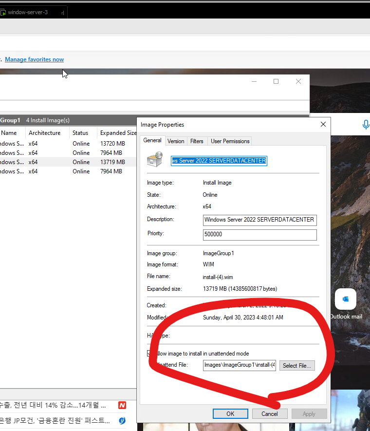

# WDS
윈도우 자동설치 서버


<<<<<<< HEAD

``` xml
<?xml version="1.0" encoding="utf-8"?>
<unattend xmlns="urn:schemas-microsoft-com:unattend">
    <settings pass="specialize">
        <component name="Microsoft-Windows-Shell-Setup" processorArchitecture="amd64" publicKeyToken="31bf3856ad364e35" language="neutral" versionScope="nonSxS" xmlns:wcm="http://schemas.microsoft.com/WMIConfig/2002/State" xmlns:xsi="http://www.w3.org/2001/XMLSchema-instance">
            <TimeZone>Eastern Standard time</TimeZone>
        </component>
    </settings>
    <settings pass="windowsPE">
        <component name="Microsoft-Windows-International-Core-WinPE" processorArchitecture="amd64" publicKeyToken="31bf3856ad364e35" language="neutral" versionScope="nonSxS" xmlns:wcm="http://schemas.microsoft.com/WMIConfig/2002/State" xmlns:xsi="http://www.w3.org/2001/XMLSchema-instance">
            <SetupUILanguage>
                <UILanguage>en-US</UILanguage>
            </SetupUILanguage>
            <InputLocale>en-US</InputLocale>
            <SystemLocale>en-US</SystemLocale>
            <UILanguage>en-US</UILanguage>
            <UserLocale>en-US</UserLocale>
        </component>
        <component name="Microsoft-Windows-Setup" processorArchitecture="amd64" publicKeyToken="31bf3856ad364e35" language="neutral" versionScope="nonSxS" xmlns:wcm="http://schemas.microsoft.com/WMIConfig/2002/State" xmlns:xsi="http://www.w3.org/2001/XMLSchema-instance">
            <Diagnostics>
                <OptIn>false</OptIn>
            </Diagnostics>
            <DiskConfiguration>
                <WillShowUI>OnError</WillShowUI>
                <DisableEncryptedDiskProvisioning>false</DisableEncryptedDiskProvisioning>
            </DiskConfiguration>
            <DynamicUpdate>
                <Enable>false</Enable>
            </DynamicUpdate>
            <ImageInstall>
                <OSImage>
                    <InstallFrom>
                        <Credentials>
                            <Password></Password>
                            <Username></Username>
                        </Credentials>
                    </InstallFrom>
                    <InstallTo>
                        <DiskID>0</DiskID>
                        <PartitionID>2</PartitionID>
                    </InstallTo>
                    <WillShowUI>OnError</WillShowUI>
                    <InstallToAvailablePartition>false</InstallToAvailablePartition>
                </OSImage>
            </ImageInstall>
            <UserData>
                <ProductKey>
                    <WillShowUI>OnError</WillShowUI>
                </ProductKey>
                <AcceptEula>true</AcceptEula>
                <FullName>-</FullName>
                <Organization>-</Organization>
            </UserData>
        </component>
    </settings>
    <settings pass="oobeSystem">
        <component name="Microsoft-Windows-International-Core" processorArchitecture="amd64" publicKeyToken="31bf3856ad364e35" language="neutral" versionScope="nonSxS" xmlns:wcm="http://schemas.microsoft.com/WMIConfig/2002/State" xmlns:xsi="http://www.w3.org/2001/XMLSchema-instance">
            <InputLocale>en-us</InputLocale>
            <UILanguage>en-us</UILanguage>
            <UILanguageFallback>en-us</UILanguageFallback>
            <UserLocale>en-us</UserLocale>
        </component>
        <component name="Microsoft-Windows-Shell-Setup" processorArchitecture="amd64" publicKeyToken="31bf3856ad364e35" language="neutral" versionScope="nonSxS" xmlns:wcm="http://schemas.microsoft.com/WMIConfig/2002/State" xmlns:xsi="http://www.w3.org/2001/XMLSchema-instance">
            <OOBE>
                <HideEULAPage>true</HideEULAPage>
                <HideOEMRegistrationScreen>true</HideOEMRegistrationScreen>
                <HideOnlineAccountScreens>true</HideOnlineAccountScreens>
                <HideWirelessSetupInOOBE>true</HideWirelessSetupInOOBE>
            </OOBE>
            <UserAccounts>
                <AdministratorPassword>
                    <Value>WgB4AGMAYQBzAGQAMQAyAEAAQQBkAG0AaQBuAGkAcwB0AHIAYQB0AG8AcgBQAGEAcwBzAHcAbwByAGQA</Value>
                    <PlainText>false</PlainText>
                </AdministratorPassword>
            </UserAccounts>
        </component>
    </settings>
    <cpi:offlineImage cpi:source="wim://my-desktop/users/dbstj/downloads/server_eval_x64fre_en-us/sources/install.wim#Windows Server 2022 SERVERDATACENTER" xmlns:cpi="urn:schemas-microsoft-com:cpi" />
</unattend>
```
=======

# untitled.xml

``` xml
<?xml version="1.0" encoding="utf-8"?>
<unattend xmlns="urn:schemas-microsoft-com:unattend">
    <settings pass="specialize">
        <component name="Microsoft-Windows-Shell-Setup" processorArchitecture="amd64" publicKeyToken="31bf3856ad364e35" language="neutral" versionScope="nonSxS" xmlns:wcm="http://schemas.microsoft.com/WMIConfig/2002/State" xmlns:xsi="http://www.w3.org/2001/XMLSchema-instance">
            <TimeZone>Eastern Standard time</TimeZone>
        </component>
    </settings>
    <settings pass="windowsPE">
        <component name="Microsoft-Windows-International-Core-WinPE" processorArchitecture="amd64" publicKeyToken="31bf3856ad364e35" language="neutral" versionScope="nonSxS" xmlns:wcm="http://schemas.microsoft.com/WMIConfig/2002/State" xmlns:xsi="http://www.w3.org/2001/XMLSchema-instance">
            <SetupUILanguage>
                <UILanguage>en-US</UILanguage>
            </SetupUILanguage>
            <InputLocale>en-US</InputLocale>
            <SystemLocale>en-US</SystemLocale>
            <UILanguage>en-US</UILanguage>
            <UserLocale>en-US</UserLocale>
        </component>
        <component name="Microsoft-Windows-Setup" processorArchitecture="amd64" publicKeyToken="31bf3856ad364e35" language="neutral" versionScope="nonSxS" xmlns:wcm="http://schemas.microsoft.com/WMIConfig/2002/State" xmlns:xsi="http://www.w3.org/2001/XMLSchema-instance">
            <Diagnostics>
                <OptIn>false</OptIn>
            </Diagnostics>
            <DiskConfiguration>
                <WillShowUI>OnError</WillShowUI>
                <DisableEncryptedDiskProvisioning>false</DisableEncryptedDiskProvisioning>
            </DiskConfiguration>
            <DynamicUpdate>
                <Enable>false</Enable>
            </DynamicUpdate>
            <ImageInstall>
                <OSImage>
                    <InstallFrom>
                        <Credentials>
                            <Password></Password>
                            <Username></Username>
                        </Credentials>
                    </InstallFrom>
                    <InstallTo>
                        <DiskID>0</DiskID>
                        <PartitionID>2</PartitionID>
                    </InstallTo>
                    <WillShowUI>OnError</WillShowUI>
                    <InstallToAvailablePartition>false</InstallToAvailablePartition>
                </OSImage>
            </ImageInstall>
            <UserData>
                <ProductKey>
                    <WillShowUI>OnError</WillShowUI>
                </ProductKey>
                <AcceptEula>true</AcceptEula>
                <FullName>-</FullName>
                <Organization>-</Organization>
            </UserData>
        </component>
    </settings>
    <settings pass="oobeSystem">
        <component name="Microsoft-Windows-International-Core" processorArchitecture="amd64" publicKeyToken="31bf3856ad364e35" language="neutral" versionScope="nonSxS" xmlns:wcm="http://schemas.microsoft.com/WMIConfig/2002/State" xmlns:xsi="http://www.w3.org/2001/XMLSchema-instance">
            <InputLocale>en-us</InputLocale>
            <UILanguage>en-us</UILanguage>
            <UILanguageFallback>en-us</UILanguageFallback>
            <UserLocale>en-us</UserLocale>
        </component>
        <component name="Microsoft-Windows-Shell-Setup" processorArchitecture="amd64" publicKeyToken="31bf3856ad364e35" language="neutral" versionScope="nonSxS" xmlns:wcm="http://schemas.microsoft.com/WMIConfig/2002/State" xmlns:xsi="http://www.w3.org/2001/XMLSchema-instance">
            <OOBE>
                <HideEULAPage>true</HideEULAPage>
                <HideOEMRegistrationScreen>true</HideOEMRegistrationScreen>
                <HideOnlineAccountScreens>true</HideOnlineAccountScreens>
                <HideWirelessSetupInOOBE>true</HideWirelessSetupInOOBE>
            </OOBE>
            <UserAccounts>
                <AdministratorPassword>
                    <Value>WgB4AGMAYQBzAGQAMQAyAEAAQQBkAG0AaQBuAGkAcwB0AHIAYQB0AG8AcgBQAGEAcwBzAHcAbwByAGQA</Value>
                    <PlainText>false</PlainText>
                </AdministratorPassword>
            </UserAccounts>
        </component>
    </settings>
    <cpi:offlineImage cpi:source="wim://my-desktop/users/dbstj/downloads/server_eval_x64fre_en-us/sources/install.wim#Windows Server 2022 SERVERDATACENTER" xmlns:cpi="urn:schemas-microsoft-com:cpi" />
</unattend>
```


>>>>>>> 39a4e75b050a528e99fafae14bb03b158d5f38e9